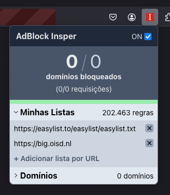
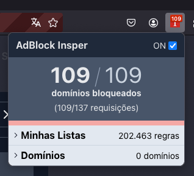

# AdBlock Insper <!-- omit from toc -->

O AdBlock Insper é uma extensão para **Mozilla Firefox** que bloqueia requisições de anúncios e rastreadores em páginas web. Este projeto foi desenvolvido para a prova final da disciplina de **Tecnologias Hackers** do curso de Engenharia da Computação do Insper.

<div style="">
  
  
</div>

## 📎 Índice
- [📎 Índice](#-índice)
- [🧾 Features:](#-features)
- [📥 Instalação](#-instalação)
- [⚙️ Build](#️-build)
  - [Desenvolvimento](#desenvolvimento)
  - [Produção](#produção)

## 🧾 Features:

- Bloqueio de requests através de listas nos formatos **AdGuard**, **uBlock Origin**, **AdBlock** e **Adblock Plus**, ou de domínios individuais
- Adição/remoção fácil de listas e domínios pelo usuário
- Opção de ligar/desligar o bloqueio (checkbox ON/OFF no canto superior direito)
- Estatísticas dos bloqueios realizados (quantidaded de domínios, requisições, etc.)
- Visualização gráfica dos bloqueios (barra verde/vermelho)
- Exibição do número de bloqueios no ícone da extensão

## 📥 Instalação

1. Faça o download da [versão pré-compilada da extensão](https://lolcdn.fracassi.tech/insper-adblock.zip).
2. Abra o Firefox e navegue para `about:debugging#/runtime/this-firefox`
3. Clique em **`Carregar extensão temporária...`** e selecione o arquivo `.zip` baixado
4. Pronto! A extensão já está disponível para uso.

## ⚙️ Build

### Desenvolvimento

1. Clone o repositório:

```bash
git clone https://github.com/pedrofracassi/insper-techacker-adblock
```

2. Instale as dependências:

```bash
yarn
```

3. Execute o ambiente de desenvolvimento:

```bash
yarn start
```

Uma janela de Firefox com a extensão já instalada se abrirá automaticamente. Note que é necessário ter o Firefox instalado previamente.

### Produção

1. Clone o repositório:

```bash
git clone https://github.com/pedrofracassi/insper-techacker-adblock
```

2. Instale as dependências:

```bash
yarn
```

3. Execute o script de build:

```bash
yarn build
```

Ao fim da build, um arquivo `.zip` será gerado na pasta `dist-zip/`. Este arquivo pode ser carregado no Firefox para instalar a extensão (ver passos 2 e 3 em [Instalação](#-instalação)) ou publicá-la na loja da Mozilla.